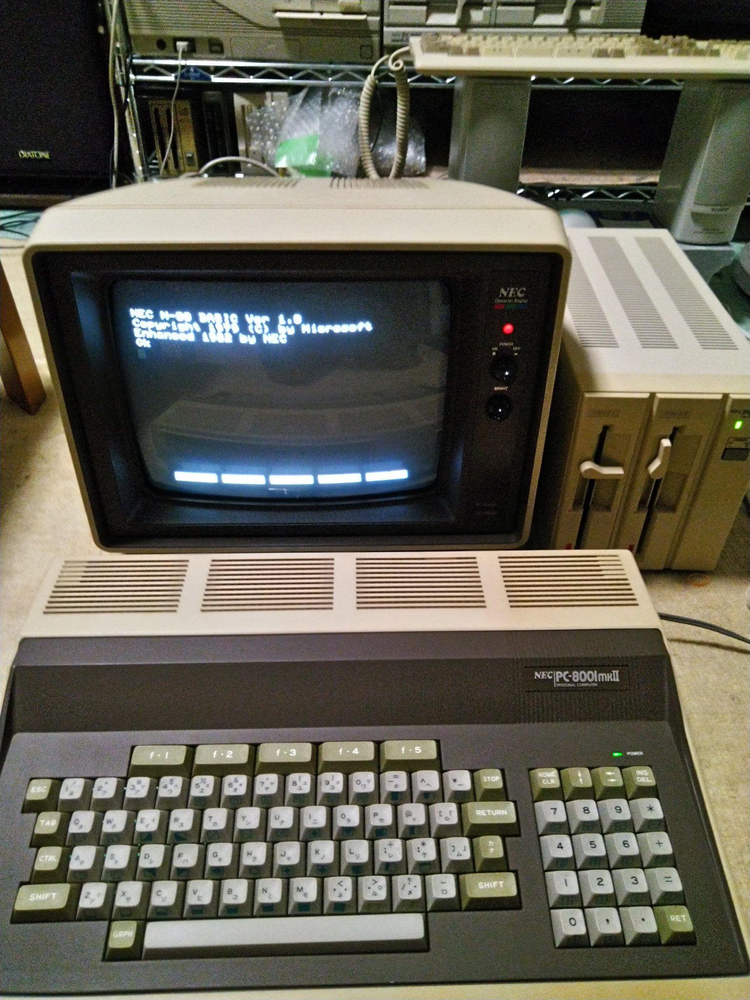
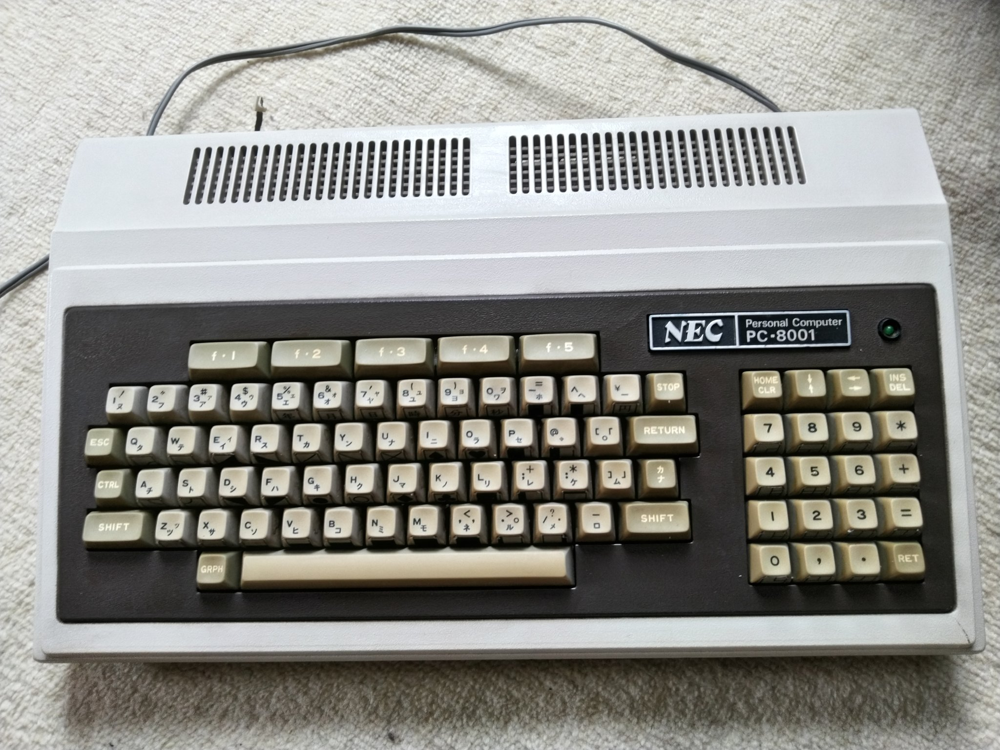

# [NEC PC-8001](https://en.wikipedia.org/wiki/PC-8000_series) for [MiSTer](https://mister-devel.github.io/MkDocs_MiSTer/)

This is a port of [@radiojunkbox](https://github.com/radiojunkbox)'s [pc8001m](https://github.com/radiojunkbox/pc8001m) core to MiSTer FPGA

## Keyboard layout

## To-Do

* Figure out video
* Load BIOS (have to substitue the MIF loading for an sdram module and loading to SDRAM probably)
* Be able to load ROMs (d88 is standard from TOSEC) (same as above, substitute current MIF loading)
* Map keyboard somehow